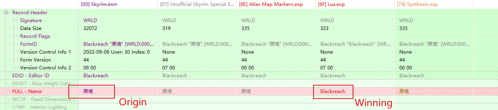

# SynStringMerger

Merge string from other mod to patched mod

## Usage

Set **Language** of synthesis to *English*

Tick **Use UTF8 For Embedded Strings**

## String Merge Source Priority

- [Custom Dictionary](#custom-dictionary)
- [High Priority Mods](#high-priority-mods), Strings from <ins>__Bottom__</ins> of Listed Mods To Top
- [Mods in Mods List](#loadorder-list) - Load order policy see details

## Settings

### Custom Dictionary

Custom Dictionary would be merged first.

### High Priority Mods

Mods that strings would be merged secondly, strings form bottom wins.

<h3 id="loadorder-list">
White List Mode, Black List, White List and <ins>Resolve From Origin</ins>
</h3>

If ticked, the string would be resolved from origin mod (Left in xEdit, low priority in ModOrganizer's Right panel)
, otherwise from the winning mod(Right in xEdit, high priority in ModOrganizer's Right panel)

**NOTICE** : This option has no effect for high priority mods

### Skip Same String

If ticked, strings that are same as winning strings would be skipped.

### Patch All Records

If ticked, all strings would be merger, otherwise only records patched by previous
Synthesis patchers would be patched

### Skip English String

Skip Strings That are full English (All characters between `\x00` and `\xff`)

### Ignore Patch Mods

Mods that has "Patch" (Case Insensitive) in their name would be ignored (no effect to high priority mod list)

### Log Path
